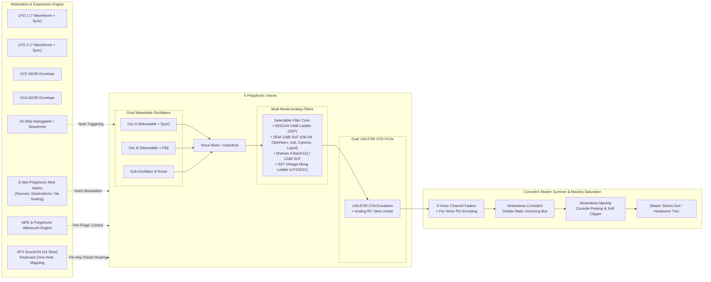

# Overviber (GliGli Overcycler)

[](https://www.gnu.org/licenses/gpl-3.0)
[]()
[]()
[](#running-verification-tests)

**Overviber** is a modernized, studio-grade 6-voice polyphonic hybrid wavetable / analog synthesizer plug-in (VST3) and standalone application. It builds on the legendary open-source GliGli Overcycler DSP architecture, heavily extended with zero-delay feedback (ZDF) analog filter modeling, an 8-slot modulation matrix, full MIDI Polyphonic Expression (MPE), a custom Overviber console inspired by Airwindows, with legacy Mackity saturation, an interactive AFX multi-sound kit, and an industrial vector UI with mixing desk faders and real-time telemetry.

---

Current implementation, measurements and known host limitations: [Audio refactoring report](AUDIO_REFACTORING_REPORT.md).

## Architecture & Signal Flow



---

## Key Features

### 1. Dual Wavetable Oscillators
- **AKWF & Single-Cycle Library**: Ships with 64 integrated Adventure Kid Single Cycle wavetables.
- **Interactive Waveform Editor**:
  - Direct waveform sample-point drawing in both Oscillator A and B.
  - One-click DSP operations: **Normalize**, **Smooth** (Butterworth lowpass), and **Invert**.
  - Frame-stepping wavetable playback and instant `.wav` single-cycle import/export.
- **Cross-Modulation & Synthesis**:
  - True Exponential FM (Frequency Modulation).
  - Hard Oscillator Synchronization (Sync).
  - Sub-Oscillator (-1 / -2 octaves) and white noise generator.

### 2. Multi-Model Analog Filters
- **Sound Semiconductor SSI2144 / SSM2044 4-Pole Ladder**:
  - Modeled using Zero-Delay Feedback (ZDF) bilinear transforms with algebraic delay-free loop resolution (Vadim Zavalishin method).
  - 2x internal oversampling to eliminate Nyquist frequency warping.
  - Precomputed matrix coefficients executing at **56.7x real-time** throughput.
  - Authentic differential pair saturation (`fastTanh`) and self-oscillation damping.
- **SEM Filter (Oberheim SEM-style 2-pole state-variable filter)**:
  - Lowpass, bandpass, highpass and notch at 12 dB/oct; the model is chosen from a dropdown:
    OB-Xd 12 dB (default, diode-pair nonlinearity), Oberheim (Pirkle/Tarr, cubic soft clipper),
    Vult SVF (tanh output saturation), Cytomic SVF (linear), and Liquid (the former
    Mutable Instruments Ripples filter with its 24/12 dB lowpass and bandpass modes).
  - All SVF variants share one resonance curve; like the SEM, they do not self-oscillate.
- **Shelves Filter (Mutable Instruments Shelves)**:
  - Vintage British 4-Band Console EQ: Low Shelf, 2 Parametric Mid Bells with interactive Q, and High Shelf.
  - 12 dB/oct State-Variable Filter (SVF) with selectable Lowpass, Bandpass, and Highpass outputs.
- **SST Vintage Moog Ladder Filter (Surge Synthesizer Team / Paul Walker)**:
  - Authentic 4-pole transistor ladder model featuring non-linear differential $\tanh()$ stage saturation and resonance-compensated feedback loop.
  - 2x internal oversampling with FIR half-band filtering for pristine high-register harmonics without digital cramping.
  - Selectable pole taps: **LP4** (24 dB/oct), **LP3** (18 dB/oct), **LP2** (12 dB/oct), and **LP1** (6 dB/oct).
  - High-performance SIMD/DSP architecture running at **34.3x real-time** throughput.

### 3. Analog VCAs, Airwindows ConsoleX Summing & Mixing Console
- **National Semiconductor LM13700 OTA Emulation**:
  - Physical analog RC filter modeling on the `I_abc` control pin ($\tau \approx 0.6\text{ ms}$) providing click- and pop-free voice stealing.
  - Differential pair transconductance curve preserving clean headroom on standard dynamics while softly compressing loud peaks.
- **Airwindows ConsoleX Summing Desk**:
  - Per-voice channel encoding using non-linear phase-dispersion encoding ($\Phi$ transform).
  - Golden Ratio summing bus with non-linear decode and variable discontinuity/depth control.
  - Channels driven harder via channel faders produce authentic analog warmth, spatial separation, and bus gluing.
- **Airwindows Mackity Insert**:
  - Emulation of legendary 1990s solid-state mixing desk input preamps.
  - Controllable input trim, variable console headroom pad, and warm asymmetrical soft-clipping.
- **Hardware-Style Mixing Desk (Modern Voice Meter Panel)**:
  - 6 individual voice channel faders + 1 stereo master bus fader with metallic caps and illuminated position indicators.
  - Recessed vertical fader tracks and 16-segment vertical peak LED meters per voice.
  - Real-time ConsoleX drive and voice allocation telemetry.

### 4. AFX Sound Kit: a sound per key (Tab AFX)
- **AFX MODE switch** on the tab: on, every key plays the sound of its pad; off, MIDI channel N plays pad N. It stays on when a preset is loaded into pad 1.
- **16 pads**: each a complete sound (preset with its waves), shown with its number, name and keys; a pad lights up while its sound plays. Click a pad (or use the arrow keys) to select it.
- **Selected pad**: pick its sound from the preset list (with previous / next), set its level, or copy the sound you edit in the other tabs onto it (pad 1 is that edited sound).
- **Keyboard**: the 128 keys drawn as a piano in their pads' colours; click or drag over keys to put them on the selected pad. Quick maps: **Octaves**, **Chromatic**, **All keys** (to the selected pad) and **Default**.
- **Save Kit / Load Kit**: the complete setup (all pads, key map, mixer) as a `.ovm` file.
- Voice count (Mono .. 6 Poly) and note priority (Last, Low, High) are in the TUNING & VOICES card of the FILTER / VCA tab.

### 5. Advanced Modulation Matrix & MPE Engine
- **8-Slot Polyphonic Matrix**:
  - **Sources**: ModWheel, Polyphonic Aftertouch, Channel Pressure, Note Velocity, Lift Velocity, LFO 1/2, VCF/VCA Envelopes, Key Tracking, Pitch Bend, Expression, Breath, MPE Slide (CC 74).
  - **Destinations**: Cutoff, Resonance, Pitch (All/Osc A/Osc B), Oscillator Detune, Waveform Modulation (A/B), VCA Level, Filter Envelope Amount, LFO 1/2 Rates, Mackity Drive.
  - **Via Modulators**: Scale any matrix connection using a secondary physical controller (e.g., ModWheel scaling LFO -> Pitch).
- **MPE (MIDI Polyphonic Expression)**:
  - Per-note independent pitch bending ($\pm 24$ semitones).
  - Per-finger CC 74 Timbre / Slide control.
  - Per-voice polyphonic pressure with 1-pole anti-zipper smoothing.

### 6. Arpeggiator & 16-Step Pattern Sequencer
- **Playback Modes**: Up, Down, Up/Down, Random, As-Played, Chord, Converge, Chord Degree, and Polyphonic Strum.
- **Interactive 16-Step Matrix**:
  - Clickable step lanes to set Play (Normal), Accent (!), Tie (~), or Rest/Mute (x).
  - Per-step harmonic degree offsets (`d1` - `d8`).
  - Tempo synchronization from host DAW ($1/4$ to $1/32\text{T}$) or free running BPM ($20 - 300\text{ BPM}$).
  - Live playhead with real-time gate length and swing preview.

### 7. Modern Studio GUI & Dual Skin Architecture
- **Dual Skin Modes**:
  - **Modern Studio View**: Sharp industrial design with high-contrast displays, vector curves, telemetry meters, collapsible section cards, and 7 functional tabs.
  - **Classic Hardware View**: Faithful reproduction of the 1980s GliGli synthesizer hardware, including 16x2 alphanumeric LCD and vintage knobs.
- **Curated Themes & Typography**:
  - 8 eye-friendly themes (Glacier Cyan, Amber CRT, Midnight Blue, Solarized Dark, Matrix Green, Royal Amethyst, Crimson Glow, Industrial Grey).
  - Embedded cross-platform D-DIN vector typography.
  - Standalone **ModernSkinDesigner** tool for designing custom HSV color themes.

---

## MIDI CC Reference Map

| CC Number | Parameter | Description / Range |
|:---------:|:----------|:--------------------|
| **1** | Mod Wheel | Assignable via Mod Matrix (Default: VCF / Pitch LFO) |
| **2** | Breath Controller | Mod Matrix Source |
| **5** | Portamento / Glide | Continuous Glide time (0 - 999) |
| **7** | Master Volume | VCA Master Level (0 - 999) |
| **11** | Expression | Mod Matrix Source / Via |
| **71** | Filter Resonance | VCF Q / Feedback (0 - 999) |
| **74** | MPE Timbre / Cutoff | Filter Cutoff Frequency / MPE Slide |
| **75** | Filter Env Amount | Bipolar VCF Envelope Depth (-499 to +499) |
| **76** | Filter Keyboard Track | Cutoff tracking across keyboard (0 - 999) |
| **77** | Filter Attack | VCF Envelope Attack time (0 - 999) |
| **78** | Filter Decay | VCF Envelope Decay time (0 - 999) |
| **79** | Filter Sustain | VCF Envelope Sustain level (0 - 999) |
| **80** | Filter Release | VCF Envelope Release time (0 - 999) |
| **81** | Amp Attack | VCA Envelope Attack time (0 - 999) |
| **82** | Amp Decay | VCA Envelope Decay time (0 - 999) |
| **83** | Amp Sustain | VCA Envelope Sustain level (0 - 999) |
| **84** | Amp Release | VCA Envelope Release time (0 - 999) |
| **85** | LFO 1 Rate | Low Frequency Oscillator 1 speed (0 - 999) |
| **86** | LFO 1 Amount | Global LFO 1 modulation depth (0 - 999) |
| **87** | LFO 2 Rate | Low Frequency Oscillator 2 speed (0 - 999) |
| **88** | LFO 2 Amount | Global LFO 2 modulation depth (0 - 999) |
| **89** | Arp Mode | Off, Up, Down, Up/Down, Random, Assign, Chord, Converge |
| **90** | Arp Division | Clock subdivision (1/4, 1/8, 1/16, 1/32, triplets) |
| **91** | Arp Gate Length | Note duration ratio per step (1 - 999) |
| **92** | Mackity Drive | Preamp input drive & saturation (0 - 999) |

---

## Directory Structure

```
GliGli Overcycler/
├── CMakeLists.txt              # CMake build definitions (VST3, Standalone, Tests, Designer)
├── README.md                   # Complete architectural and user documentation
├── GUI_DESIGN_GUIDE.md          # Modern UI styling specifications & guidelines
├── GITHUB_PUBLISHING_GUIDE.md   # How releases are published (tag → CI packages)
├── MULTIPLATFORM_GUIDE.md      # Platform-specific build & installation notes
├── PROJEKTANALYSE.md           # Project analysis of 28.09.2026 with update (German)
├── disk/                       # Factory data directory
│   ├── PRESETS/                # 50 factory .conf presets (original Overcycler firmware)
│   └── WAVEDATA/               # AKWF Single-cycle wavetables & User samples
├── doc/                        # Component datasheets (PDF) & calculation sheets
├── firmware_17xx/              # Original Overcycler LPC1778 firmware
├── hardware/, enclosure/       # Original KiCad hardware & enclosure designs
├── m4l/                        # Max for Live performance companion
└── vst/
    ├── Source/
    │   ├── PluginProcessor.*   # JUCE AudioProcessor & host parameter management
    │   ├── data/               # Editor model and files
    │   │   ├── SynthModel.*    # Editor model: 16 parts, routing, mixer, arp sequence
    │   │   ├── PresetManager.* # Preset files (.conf)
    │   │   ├── WaveManager.*   # Wave files and per-part wave data
    │   │   └── SessionState.h  # Setup files (.ovm) and host state
    │   ├── dsp/                # Audio engine (no file access)
    │   │   ├── SynthEngine.*   # 6 voices, 16 parts, rendering from a PreparedState
    │   │   ├── MidiInput.*     # Controllers and per-note expression
    │   │   ├── VoiceAllocator.*# Part routing, note CVs, glide
    │   │   ├── Modulation.*    # Control-rate modulation per voice
    │   │   ├── MasterBus.h     # Console, Mackity send, ceiling
    │   │   ├── Voice.*         # Individual voice signal path
    │   │   ├── wtosc.*         # Anti-aliased band-limited wavetable oscillator
    │   │   ├── Ssi2144Filter.h # 4-pole ZDF ladder filter model
    │   │   ├── Lm13700Vca.h    # OTA saturation & slew limiter VCA
    │   │   ├── arp.*           # 16-step arpeggiator engine
    │   │   └── audible/        # Mutable Instruments filter ports (Ripples & Shelves)
    │   └── ui/                 # User Interface
    │       ├── PluginEditor.*  # Master JUCE AudioProcessorEditor
    │       ├── ModernEditorView.* # Main Modern Studio GUI container
    │       ├── ModernPresetManager.* # Preset browser with tag chips and search
    │       ├── components/     # Modularized UI components
    │       │   ├── ModernLookAndFeel.*     # Custom industrial skin styling
    │       │   ├── ModernSectionCard.*     # Sharp grouping container cards
    │       │   ├── WaveformEditorComponent.* # Wavetable drawer & manager
    │       │   ├── FilterCurveComponent.*  # Interactive frequency response curve
    │       │   ├── AdsrCurveComponent.*    # Interactive ADSR visualizer
    │       │   └── ModernTelemetryComponents.* # Voice meter, LFO scope, Arp matrix
    │       ├── theme/          # Color palettes and typography manager
    │       └── designer/       # Standalone theme & font explorer application
    └── Tests/                  # Automated C++ test scenario suites
```

---

## Building from Source

### Prerequisites
- **CMake**: Version 3.22 or higher.
- **C++ Compiler**:
  - Windows: Visual Studio 2022 (MSVC 64-bit) with C++17 support.
  - macOS: Xcode 14+ / Clang; deployment target macOS 10.15 or newer (required by `std::filesystem`).
  - Linux: GCC 11+ or Clang 14+ with standard audio development libraries (`libasound2-dev`, `libfreetype6-dev`, `libx11-dev`, `libxinerama-dev`, `libxrandr-dev`, `libxcursor-dev`, `libgl1-mesa-dev`).

### Build Instructions

> [!TIP]
> For platform-specific installation instructions (including macOS Gatekeeper unquarantine and Linux installation scripts), see the dedicated [MULTIPLATFORM_GUIDE.md](MULTIPLATFORM_GUIDE.md).

```bash
# 1. Clone repository with submodules (JUCE)
git clone --recurse-submodules https://github.com/mahik303-tech/Overviber.git
cd Overviber

# 2. Configure project via CMake
cmake -B build -DCMAKE_BUILD_TYPE=Release

# 3. Compile VST3, AU (macOS) and Standalone binaries
cmake --build build --config Release --parallel
```

The build does not install anything by default. To copy the plug-ins into the
system plug-in folders after each build (Windows: `C:\Program Files\Common Files\VST3`,
administrator rights required), configure with `-DJUCE_COPY_PLUGIN_AFTER_BUILD=ON`.
Use `-DBUILD_TESTING=OFF` for a product-only build.

Built artifacts will be located in:
- **Windows**: `build/Overviber_artefacts/Release/VST3/Overviber.vst3` & `build/Overviber_artefacts/Release/Standalone/Overviber.exe`
- **macOS**: `build/Overviber_artefacts/Release/VST3/Overviber.vst3`, `AU/Overviber.component` & `Standalone/Overviber.app`
- **Linux**: `build/Overviber_artefacts/Release/VST3/Overviber.vst3` & `Standalone/Overviber`

---

## Running Verification Tests

All test programs are registered with CTest (16 tests). Assertions stay active in
Release builds, test data comes from this checkout's `disk/` folder, and every
test writes into its own folder under `build/test-results/`; user folders are never touched.

```bash
cmake --build build --config Release --parallel
ctest --test-dir build -C Release --output-on-failure
```

| Area | CTest tests |
|:-----|:------------|
| Filters & calibration | `FilterScenarioTest` |
| Arpeggiator & sequencer | `ArpScenarioTest` |
| MIDI, MPE & timing | `AdvancedMidiScenarioTest`, `MidiClickScenarioTest`, `PluginTimingScenarioTest` |
| Modulation matrix | `ModMatrixScenarioTest` |
| Console, AFX parts & setups | `ConsoleXAndAfxScenarioTest`, `RefactoringScenarioTest` |
| Elements synthesis | `ElementsScenarioTest`, `ElementsVoiceScenarioTest` |
| Factory presets & audio regression | `FactoryPresetHeadroomScenarioTest`, `FactoryVoiceDistributionScenarioTest`, `AudioRegressionScenarioTest` |
| Storage paths | `StorageScenarioTest` |
| User interface | `ClassicSkinScenarioTest`, `ModernSkinScenarioTest` (skipped on Linux without X display) |

`AudioReferenceCompare` checks the audio engine bit-exactly against a local
baseline (see [REFACTORING.md](REFACTORING.md#audio-engine-refactoring-2026-09)).
It is skipped until a baseline exists:

```powershell
build-check\Release\AudioReferenceRender.exe --out build-check\audio-baseline
build-check\Release\AudioReferenceRender.exe --compare build-check\audio-baseline
build-check\Release\AudioReferenceRender.exe --bench
```

`Preset0048MidiScenarioTest` is built as a manual analysis tool and is not part
of the CTest run.

---

## License & Acknowledgements

- **Main Project License**: [GNU General Public License v3.0 (GPL-3.0)](LICENSE)
- **GliGli (Laurent Lecatelier)**: Original Overcycler hardware synthesizer design, DSP architecture, and embedded firmware ([firmware_17xx](firmware_17xx/synth/)), including the core **Arpeggiator** (`arp.c`), **Voice Assigner** (`assigner.c`), **Wavetable Oscillator** (`wtosc.c`), **ADSR Envelopes** (`adsr.c`), and **LFOs** (`lfo.c`) (GPL-3.0).
- **Yves Parès (Arpligner)**: Concepts for chord degree alignment (`amDegree`) and polyphonic strum sequencing (`amStrum`) ([Arpligner](https://github.com/YPares/arpligner), Mozilla Public License 2.0 with Commons Clause).
- **Sound Semiconductor**: SSI2144 datasheet and SSM2044 legacy documentation.
- **Vadim Zavalishin**: Zero-Delay Feedback (ZDF) bilinear transform methodology ("The Art of VA Filter Design").
- **Émilie Gillet / Mutable Instruments & Tyler Coy**: Analog filter models for Ripples (Liquid Filter) and Shelves (Console EQ & SVF) (GPL-3.0).
- **Surge Synthesizer Team & Paul Walker (sst-filters)**: Vintage 4-pole Moog Ladder Filter model with non-linear saturation, multi-pole taps, and 2x oversampling; OB-Xd 12 dB and Cytomic SVF models of the SEM filter ([sst-filters](https://github.com/surge-synthesizer/sst-filters), GPL-3.0).
- **OB-Xd project**: Original OB-Xd filter from which the sst-filters OB-Xd model is adapted ([OB-Xd](https://github.com/reales/OB-Xd), GPL-3.0).
- **Andrew Simper / Cytomic**: Trapezoidal state-variable filter design used by the Cytomic SVF model.
- **Eric Tarr & Will Pirkle**: Oberheim state-variable filter model from the FAUST standard library, after "Designing Software Synthesizer Plug-ins in C++" ([faustfilters](https://github.com/SpotlightKid/faustfilters), MIT-style STK-4.3 license).
- **Leonardo Laguna Ruiz / Vult**: State-variable filter and soft saturation from the Vult examples ([vult](https://github.com/vult-dsp/vult), MIT).
- **Chris Johnson / Airwindows**: Mackity console line preamp saturation & ConsoleX Golden Ratio non-linear channel encoder and bus summer ([Airwindows](https://github.com/airwindows/airwindows), MIT License).
- **JUCE Framework**: JUCE audio plug-in and graphical application framework (GPL-3.0).
